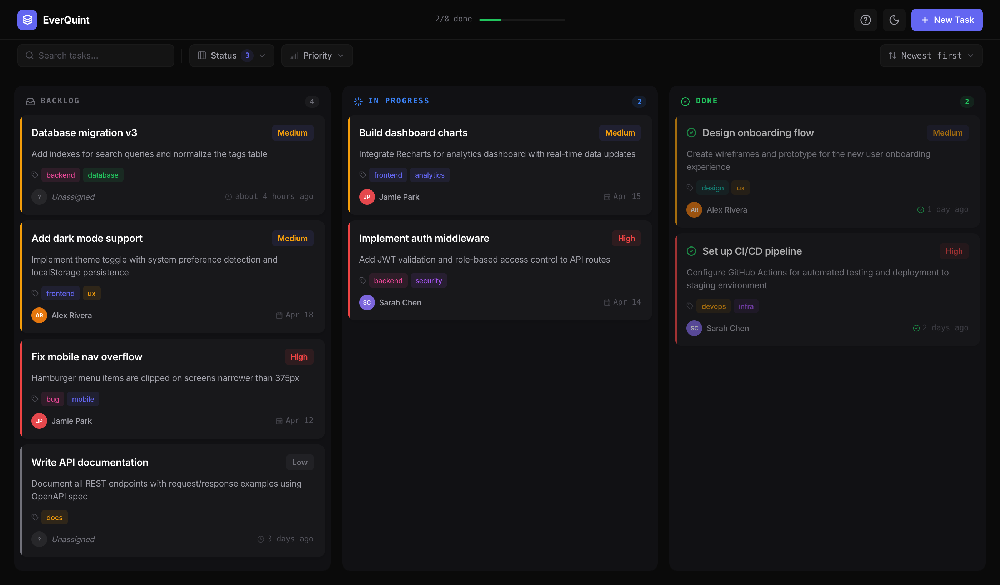
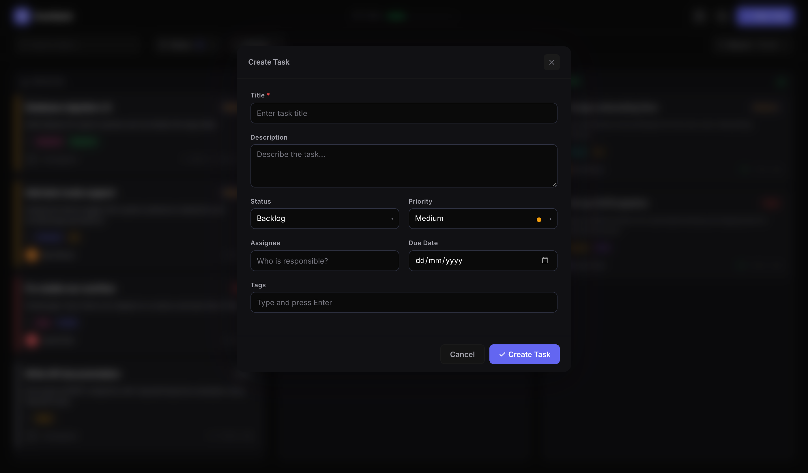
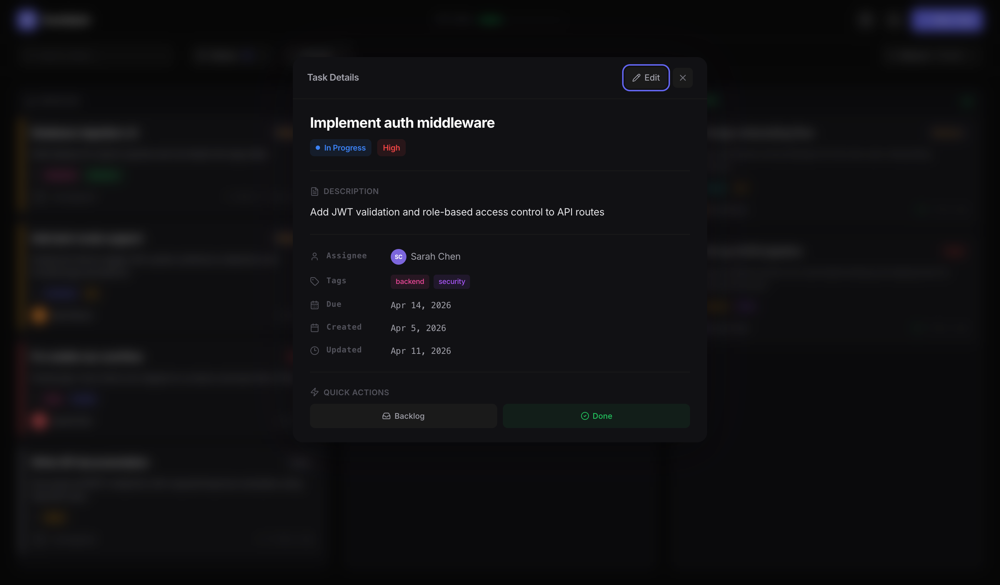
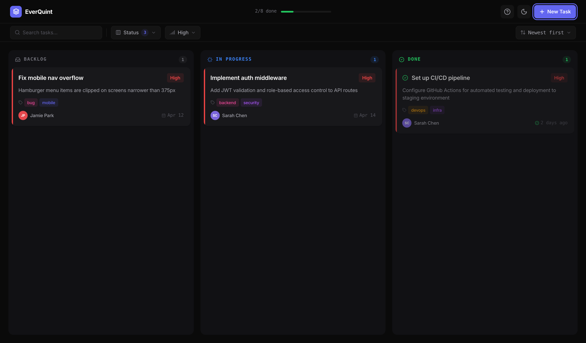
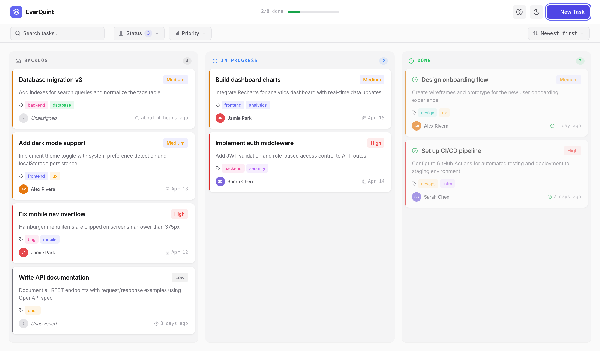
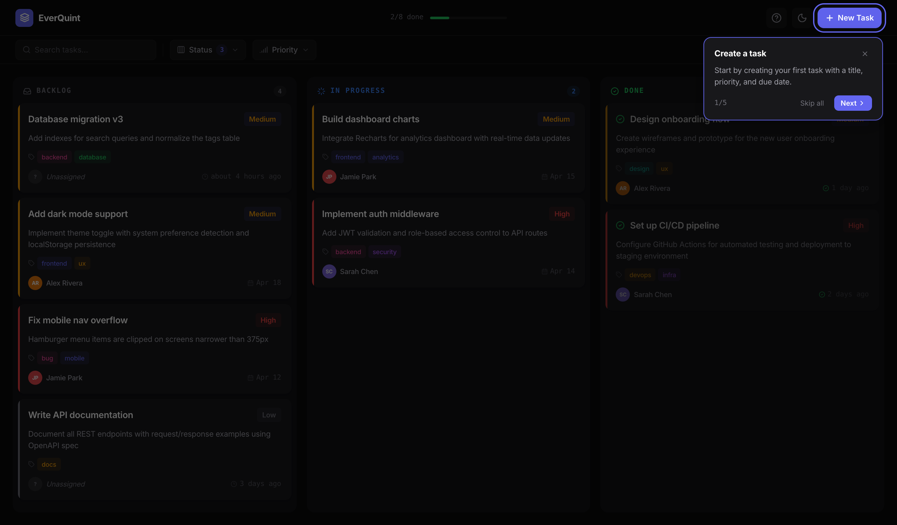

# EverQuint - Product Walkthrough

A visual guide to EverQuint, a team workflow board built with React, TypeScript, and Zustand.

## Board Overview



The main board displays tasks across three Kanban columns: **Backlog**, **In Progress**, and **Done**. Each task card shows:

- **Title** and **description** preview (2-line clamp)
- **Priority badge** (High / Medium / Low) with color coding
- **Tags** as colored pills
- **Assignee** with avatar initials, or "Unassigned" placeholder
- **Due date** or relative timestamp ("2 days ago")
- **Priority stripe** on the left edge for quick visual scanning
- **Done cards** render with reduced opacity and a checkmark icon

The header shows the app name, a progress bar (e.g. "2/8 done"), and action buttons.

## Creating & Editing Tasks



Click **+ New Task** to open the creation modal. Fields include:

- **Title** (required, 3-100 characters)
- **Description** (multi-line, up to 500 characters)
- **Status** and **Priority** selects with visual indicators
- **Assignee** (free text)
- **Due Date** (native date picker, themed to match dark/light mode)
- **Tags** (inline chip input - type and press Enter, Backspace to remove last)

Form validation shows inline errors. If you have unsaved changes and try to close, a confirmation prompt appears.

## Task Detail View



Click any task card to open the detail modal showing:

- Full title with **status** and **priority** badges
- Complete description
- **Meta grid**: assignee (with avatar), tags, due date, created/updated timestamps
- **Overdue indicator** (red) when a task is past its due date
- **Quick Actions**: one-click buttons to move the task to any other column
- **Edit** button to switch to the edit form

## Filtering & Sorting



The toolbar provides powerful filtering with URL sync:

- **Search** - debounced text search across titles and descriptions
- **Status** - multi-select dropdown (Backlog, In Progress, Done)
- **Priority** - single-select filter (High, Medium, Low)
- **Sort** - Last updated, Newest first, Oldest first, Priority ascending/descending

All filter state is serialized to URL query parameters (e.g. `?priority=High`), making views **bookmarkable and shareable**. Refreshing the page restores the exact filter state.

## Light & Dark Themes



Toggle between dark and light mode using the moon/sun icon in the header. Theme preference is persisted in localStorage. The entire design system adapts:

- All surfaces, borders, and text colors switch via CSS custom properties
- Priority badges, status indicators, and tag colors maintain contrast in both themes
- Native form elements (date picker, selects) respect `color-scheme`

## Guided Onboarding Tour



First-time visitors see a 5-step guided tour that highlights key features:

1. **Create a task** - points to the New Task button
2. **Kanban columns** - highlights the first column, explains drag-and-drop
3. **Search & filter** - spotlights the filter toolbar
4. **Dark & light mode** - points to the theme toggle
5. **Replay this tour** - shows the help button for replaying

The tour uses a dimmed backdrop with the target element elevated above it, a positioned tooltip with step counter, and Skip all / Next / Got it controls. Progress is saved to localStorage. Click the **?** button in the header to replay anytime.

## Drag & Drop

Tasks can be dragged between columns to change their status. The card lifts with a shadow effect while dragging, and the target column highlights to indicate the drop zone. Status, timestamps, and completion state update automatically.

## Data Persistence

All data is stored in **localStorage** with schema versioning:

- Schema version is tracked (currently v2)
- Automatic migrations run on load when an older schema is detected
- A non-intrusive toast notification appears after migration
- If localStorage is unavailable, a warning is displayed

## Keyboard Accessibility

- **Tab** cycles through interactive elements
- **Escape** closes any open modal
- **Enter** submits forms or adds tags
- **Backspace** removes the last tag (when tag input is empty)
- All interactive elements have visible focus indicators
- Modals trap focus and restore it on close

---

## Quick Start

```bash
npm install
npm run dev        # http://localhost:5173
npm test           # Run test suite
npm run build      # Production build
```

See [README.md](README.md) for architecture overview and [ARCHITECTURE.md](ARCHITECTURE.md) for detailed technical documentation.
