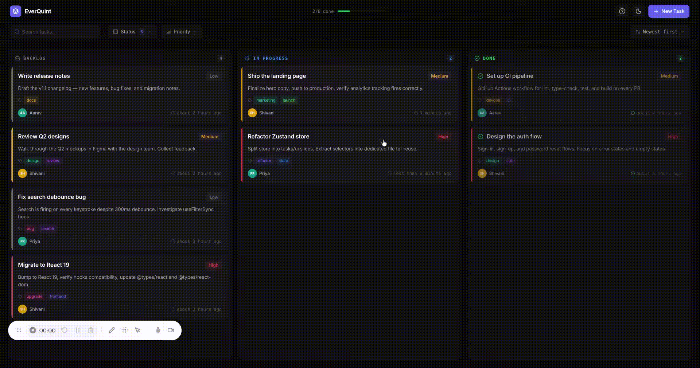

<div align="center">


<a href="https://ever-quint.vercel.app">
  
</a>

<p>
  
  
  
  
  
</p>

<p>
  <a href="https://ever-quint.vercel.app"><b>🌐&nbsp;&nbsp;Live Demo</b></a>
  &nbsp;&nbsp;·&nbsp;&nbsp;
  <a href="./ARCHITECTURE.md"><b>📐&nbsp;&nbsp;Architecture</b></a>
  &nbsp;&nbsp;·&nbsp;&nbsp;
  <a href="./GUIDE.md"><b>📖&nbsp;&nbsp;Guide</b></a>
  &nbsp;&nbsp;·&nbsp;&nbsp;
  <a href="https://github.com/shivani2001-art/ever-quint/issues"><b>🐛&nbsp;&nbsp;Report Bug</b></a>
</p>

<br>



<sub>✨ <i>Create a task, quick-action it to In Progress, then mark it Done. Watch the progress bar fill up in real time.</i></sub>

</div>

<br>


## 🤔 &nbsp;Why Quint?

> Most task apps drown you in features. Quint gets out of your way.
> **Three columns. Drag to move. Type to create. Share via URL. Done.**

- 🪶 &nbsp;**No accounts, no setup.** &nbsp;Open the page, start working. Your data stays on your device.
- 🔗 &nbsp;**URL-shareable filters.** &nbsp;Every filter, sort, and search lives in the URL — bookmark it, share it, hit back to undo.
- ⌨️ &nbsp;**Designed for the keyboard.** &nbsp;Full ARIA support, focus traps, escape-to-close, tab everywhere.
- 🌓 &nbsp;**Theme-aware.** &nbsp;Light or dark, your call. Remembers your choice across sessions.
- 🧱 &nbsp;**Built to last.** &nbsp;Schema-versioned localStorage with a forward-compatible migration pipeline.

<br>


## 📸 &nbsp;Gallery

<table>
  <tr>
    <td align="center" width="50%">
      <br>
      <sub>☀️&nbsp; <b>Light mode</b> — clean and crisp</sub>
    </td>
    <td align="center" width="50%">
      <br>
      <sub>🌙&nbsp; <b>Dark mode</b> — easy on the eyes</sub>
    </td>
  </tr>
  <tr>
    <td align="center">
      <br>
      <sub>✏️&nbsp; <b>Create tasks</b> — validated forms with dirty-state tracking</sub>
    </td>
    <td align="center">
      <br>
      <sub>🔍&nbsp; <b>Task detail</b> — quick status changes & rich metadata</sub>
    </td>
  </tr>
  <tr>
    <td align="center">
      <br>
      <sub>🎛️&nbsp; <b>Powerful filters</b> — synced to the URL for sharing</sub>
    </td>
    <td align="center">
      <br>
      <sub>🎯&nbsp; <b>Guided onboarding</b> — spotlight tour for first-time users</sub>
    </td>
  </tr>
</table>

<br>


## 🚀 &nbsp;Quick Start

```bash
git clone https://github.com/shivani2001-art/ever-quint.git
cd ever-quint
npm install
npm run dev          # → http://localhost:5173
```

| Script | What it does |
|---|---|
| `npm run dev` | 🔥 &nbsp;Start the Vite dev server with HMR |
| `npm run build` | 📦 &nbsp;Type-check, then build for production into `dist/` |
| `npm run preview` | 👀 &nbsp;Preview the production build locally |
| `npm test` | 🧪 &nbsp;Run the Jest + React Testing Library suite |
| `npm run lint` | 🧹 &nbsp;Lint with ESLint |

<br>


## ✨ &nbsp;Feature Highlights

<table>
  <tr>
    <td width="33%" valign="top">
      <h3>🪶 &nbsp;Zero Setup</h3>
      <p>Open the tab and start working. No account, no database, no server handshake. Your data lives in your browser.</p>
    </td>
    <td width="33%" valign="top">
      <h3>⌨️ &nbsp;Keyboard First</h3>
      <p>Tab through everything. Escape to close. Enter to confirm. Every interaction has a shortcut — mouse optional.</p>
    </td>
    <td width="33%" valign="top">
      <h3>🔗 &nbsp;Share a URL</h3>
      <p>Every filter, sort, and search lives in the querystring. Bookmark the view. Send it to a teammate. Hit back to undo.</p>
    </td>
  </tr>
  <tr>
    <td valign="top">
      <h3>🖱️ &nbsp;Drag to Move</h3>
      <p>Reorder between columns with <code>@hello-pangea/dnd</code>. For keyboard and mobile, quick-action buttons in the task detail do the same job.</p>
    </td>
    <td valign="top">
      <h3>🌗 &nbsp;Light &amp; Dark</h3>
      <p>System-aware theme switcher, persisted across sessions. Both modes tuned by hand — not a <code>:invert()</code> filter in sight.</p>
    </td>
    <td valign="top">
      <h3>🎯 &nbsp;Spotlight Tour</h3>
      <p>First-time users get a guided walkthrough with animated spotlight highlights. Runs once, then gets out of the way.</p>
    </td>
  </tr>
  <tr>
    <td valign="top">
      <h3>🧱 &nbsp;Built to Last</h3>
      <p>Schema-versioned <code>localStorage</code> with a forward-compatible migration pipeline. Change the shape of a task without breaking old data.</p>
    </td>
    <td valign="top">
      <h3>⚡ &nbsp;Profiler-Tuned</h3>
      <p><code>useMemo</code>-gated filter/sort. <code>useCallback</code>-stable handlers. Every re-render audited with React DevTools.</p>
    </td>
    <td valign="top">
      <h3>🧪 &nbsp;Tested</h3>
      <p>Jest + React Testing Library covering the hot paths: create, edit, filter, sort, delete. Fast enough to run on every save.</p>
    </td>
  </tr>
</table>

<br>


## 🧱 &nbsp;Tech Stack

<div align="center">


<br>


<br>


</div>

<br>


## 🏗️ &nbsp;Architecture at a Glance

```
src/
├── components/
│   ├── ui/              ← Reusable primitives (Button, Modal, Toast, …)
│   └── board/           ← Domain components (Board, Column, TaskCard, …)
├── features/tasks/      ← Zustand store + selectors
├── hooks/               ← useTaskForm, useFilterSync, useTheme, …
├── utils/               ← Storage, migrations, ID generation
└── types/               ← Shared TypeScript contracts
```

<details>
<summary><b>🎯 &nbsp;Key design decisions</b> &nbsp;<i>(click to expand)</i></summary>

<br>

| Decision | Choice | Why |
|---|---|---|
| **State management** | Zustand | Simpler API than Context, built-in selectors, no provider nesting, minimal boilerplate. |
| **Styling** | CSS Modules + CSS variables | Co-located styles, zero runtime cost, themeable via design tokens. |
| **Status changes** | Drag-and-drop *and* detail quick actions | DnD for fast triage, buttons for keyboard/mobile. |
| **Filter persistence** | URL query parameters | Shareable, bookmarkable, browser-back-friendly. |
| **Data persistence** | localStorage + schema versioning | Works offline, no backend, safe to evolve. |
| **UI components** | Hand-built library | Full control over a11y, theming, and bundle size. |

See [ARCHITECTURE.md](./ARCHITECTURE.md) for the full component hierarchy, data flow diagrams, and extension guides.

</details>

<details>
<summary><b>⚡ &nbsp;Performance notes</b></summary>

<br>

A profiler pass with React DevTools surfaced two avoidable re-renders:

1. **`Board` was re-running filter+sort on every render.** Fixed by memoizing `getFilteredAndSortedTasks()` with `useMemo`, gated on `tasks` and `filters`.
2. **`handleDragEnd` was being recreated each render**, busting `Column`'s memoization. Wrapped in `useCallback`.

Both changes are intentionally narrow — no premature optimization elsewhere.

</details>

<br>


## 🗺️ &nbsp;Roadmap

- [ ] 🌐 &nbsp;Real-time multi-user collaboration (WebSocket/SSE)
- [ ] ☁️ &nbsp;Backend API for cross-device sync
- [ ] 📎 &nbsp;File attachments on tasks
- [ ] 🔐 &nbsp;User accounts & authentication
- [ ] 📝 &nbsp;Subtasks and checklists
- [ ] 🔁 &nbsp;Recurring tasks
- [ ] 📅 &nbsp;Calendar view

<br>


## 🚢 &nbsp;Deployment

Quint ships to Vercel. Production deploys are a single command:

```bash
./node_modules/.bin/vercel --prod
```

Live at **[ever-quint.vercel.app](https://ever-quint.vercel.app)** 🌐

<br>


## 🌟 &nbsp;Star History

<a href="https://star-history.com/#shivani2001-art/ever-quint&Date">
  
</a>

<br><br>


<div align="center">

**Built with 💜 &nbsp;by [@shivani2001-art](https://github.com/shivani2001-art)**

<sub>⭐ &nbsp;If Quint helped you ship something, leave a star — it makes my day.</sub>

</div>
